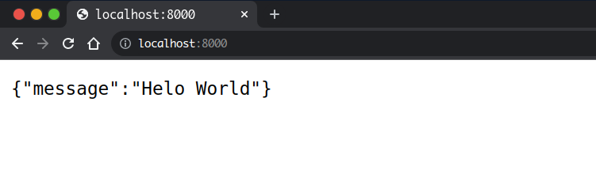

# 01- Introduction to FastAPI

## What is FastAPI?

FastAPI is a web framework written in Python that is specifc to building web APIs. FastAPI gives a very easy to develop REST as well as GraphQL APIs.In this module I introduce FastAPI and we look at what you need to know to get started. FastAPI allows you to use features of modern Python features to build web APIs.    


To build a FastAPI application you will start by creating a virtual environment with  


```
$ python3 -m venv env
```

Go ahead and activate the virtual environment

On Linux / MacOS

```
$ source env/bin/activate
```

On Windows (CMD)

```
$ env\Scripts\activate.bat
```

Within our virtual environment, then we proceed to installing FastAPI with the `pip` package manager

```
(env) $ pip install fastapi
```

At this point, shall have the following folder structure

```
├── env
└── main.py
```

`main.py` will be our main application file. Ok, let us build our first FastAPI application. In main.py, go ahead and add the following code.  


```python
from fastapi import FastAPI


app = FastAPI()


@app.get("/")
def index():
    return {"message": "Helo World"}
```

This code alone has helped us to build our first FastAPI application.  


### What has happened?

We begin by importing the `FastAPI` class from the `fastapi` package. This helps us to create the main instance of our application. This instance allows us to create URLs which lead to different parts of our application.

`@app.get('/')` describes which HTTP method we shall use while accessing the `/` URL of our application. For this case, we are calling the `GET` HTTP method. This means that we can as well call other HTTP methods like

- `POST` with `@app.post`
- `PUT` with `@app.put`
- `PATCH` with `@app.patch`
- `DELETE` with `@app.delete`

on a URL such as `/`.


We created a function called `index` that will handle a request for the `/` URL. This returns a JSON message of `Helo World`.  


Now let us run our application. To run it, we shall install `uvicorn` which is an ASGI server that will help our application to run asynchronously. In your command prompt or terminal, type the following command  


```
(env)$ pip install uvicorn
```  


Another step we shall make is to add our dependencies to a `requirements.txt` file so that we keep track of the versions of our packages. Do that with:

```
(env)$ pip freeze > requirements.txt
```

This is going to update our folder structure to

```
├── env
├── main.py
└── requirements.txt
```

Finally, run the server with `uvicorn`.

```
uvicorn main:app --reload
```

### What's happening?

We run the application with uvicorn in our terminal, uvicorn runs the server in the following way.

```
uvicorn <name of module with app instance>:<app instance>
```

In this case, our app module is `main.py` which we specify as `main` and our app instance is `app`. Passing the `--reload` option helps us to restart the server when we make changes to the code during development. Running the above command will help start our development server and we shall see this output in the terminal.

```
(env)$ uvicorn main:app
INFO:     Will watch for changes in these directories: ['/home/jod35/coding/Building_web_Applications_with_FastAPI/src']
INFO:     Uvicorn running on http://127.0.0.1:8000 (Press CTRL+C to quit)
INFO:     Started reloader process [10411] using statreload
INFO:     Started server process [10413]
INFO:     Waiting for application startup.
INFO:     Application startup complete.
```

Alright, so now the server is running and we can see the output when we make a request to `http://127.0.0.1:8000`. We can also notice that uvicorn will listen for changes in our code. So visit the URL and you will see the following ouput.  


  


Congragulations!!! 🎉 you have been able to create and run your first FastAPI application.

In this post, you have got a very simple introduction to FastAPI. you have learned the following.  


1. Creating a virtual evironment and using it to manage your project dependencies
2. Create a FastAPI app
3. Run a FastAPI app

Thanks for reading, in the text tutorial you learn more about FastAPI.
