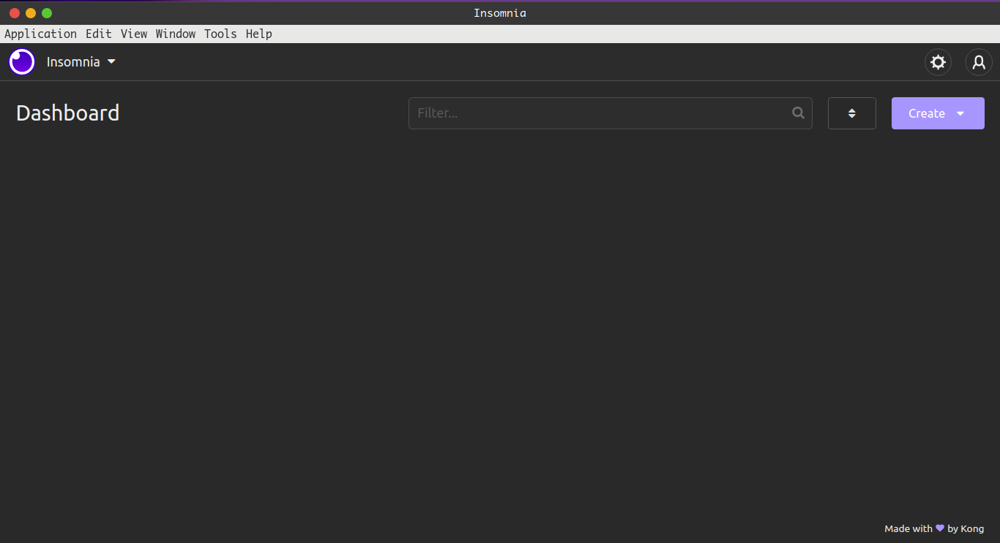
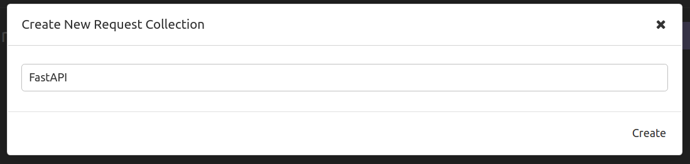
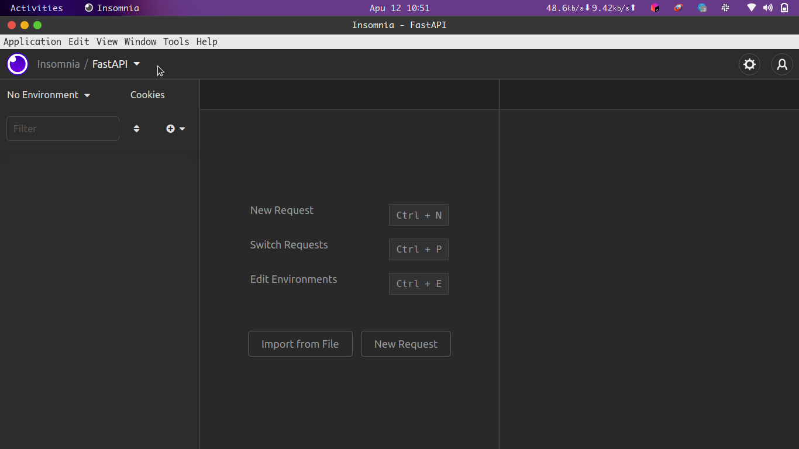
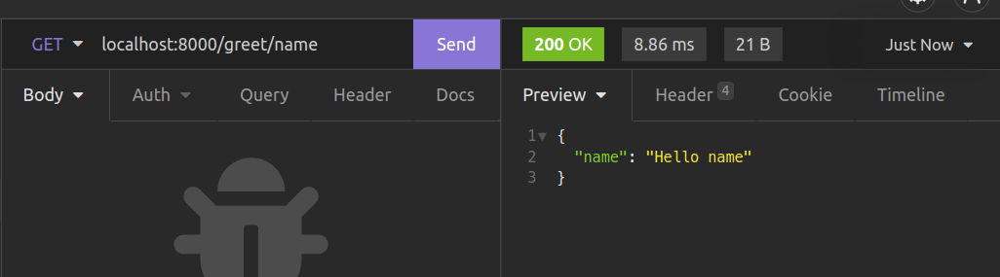
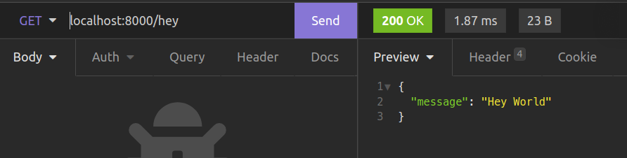
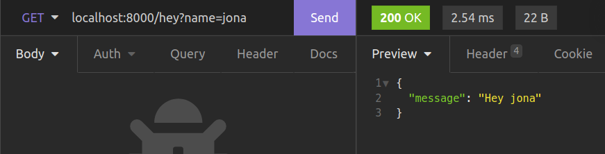
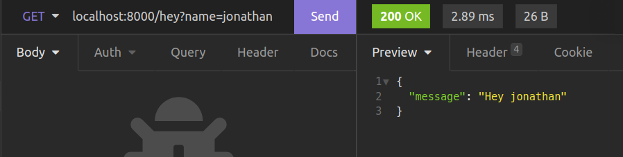
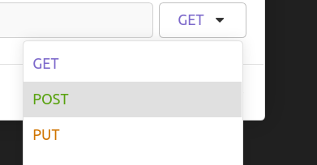
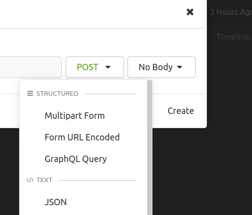
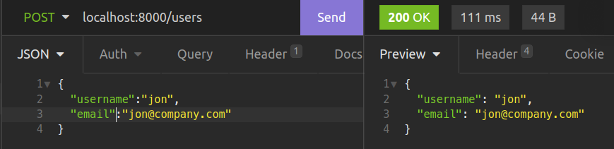

# 02 Requests

Through requests, users can interact with an API as they can send data and also receive data from an API.

In the previous example, we created our first FastAPI application. We also went ahead and ran it with `uvicorn`. Now we are going to look at how requests are made and how a response is returned.

Each time we create a route like below, we create a function that handles a request to a given URL, this function is invoked when we visit a URL.

```python
@app.get("/")
def index():
    return {"message": "Helo World"}

```

In this example, we are making a request to the `/` URL and are getting a JSON response of `{"message": "Helo World"}`.

The `@app` decorator above includes an HTTP method that is used when making a request. In our example, this is the `GET` request. Now let us create more routes by adding this code.

```python
@app.get('/greet/{name}')
def greet_name(name:str):

    return {"name":f"Hello {name}"}


@app.get("/hey")
def greet_optional_name(name:Optional[str]="World"):

    return {"message": f"Hey {name}"}
```

We have created two URLs one is `/greet/{name}` and this takes in a [path parameter](https://fastapi.tiangolo.com/tutorial/path-params). The second one is `/hey` and this should take in an optional [query parameter](https://fastapi.tiangolo.com/tutorial/query-params) `name` that defaults to `"World"`.

### Let us change something.

For the previous examples, we have been using our web Browser to make requests to our URLs. We are going to change to [Insomnia](https://insomnia.rest/). This is an open-source API client that allow us to easily and quickly send [REST](https://en.wikipedia.org/wiki/Representational_state_transfer), [GraphQL](https://en.wikipedia.org/wiki/GraphQL), [SOAP](https://en.wikipedia.org/wiki/SOAP) and [GRPC](https://en.wikipedia.org/wiki/GRPC) requests.

I know that has been a lot 😅. But basically `Insomnia` will really help us to make requests to our REST API easily.

### Steps to Use Insomnia

1. Download one for your operating system [here](https://insomnia.rest/download) and Install it.

2. Open it and you will see the following home screen.



3. Create a request collection

  
4. Give the collection a name

  
5. Then you will go to this UI  
  
6. Create a request and make a request  


### Note

I will be using Insomnia in this course, please feel free to use other API clients. Ok, so let use try accessing the URLS we have created on our API.

## Path Parameters

We shall begin with the `/greet/{name}` endpoint which is going to take in a path parameter.

Path parameters are variables we pass in our URL so that we can be able to perform a certain task.

```python
@app.get('/greet/{name}')
def greet_name(name:str):

    return {"name":f"Hello {name}"}
```



In this example we have passed a name `"name"` within our URL and then made a `GET` request to the `/greet/{name}` URL. This allows us to return the JSON response of `{"name": "Hello name"}`.

Our path parameter is the name `"name"` which is a string. This name is taken in by our request handler function that will return response as we see above. Our function takes in the `name` which is a string and in this case we are using type hints to specify that we shall have our name as a function.

```python
def greet_name(name:str):

    return {"name":f"Hello {name}"}

```

## Advanced Path Parameter Validation

In case we need some advanced validation of our path parameters, we use the `Path` function from FastAPI to allow us do this. Go ahead and make these adjustments to the `greet_optional_name` function.

```python

from fastapi import Path

@app.get('/greet/{name}')
def greet_name(name:str=Path(default="World", max_length=6)):

    return {"name":f"Hello {name}"}
```

Here we, use the `Path` function to give path parameter of `name` a `default` of `"World"` as well as a `max_length` of 6 characters. This works the same as for our previous path parameter example. However, we have some nice validations taking place. For example, when we try to make a request to the `/greet/{name}` URL, with a name longer than 6 characters,


We now see that an error with status code of 422 (Unprocessable Entity) has been shown to us. We have to provide a `name` that passes our validations.

FastAPI heavily relies on type hints to determine what request handlers take and also to validate the data that we pass to our API as we shall see later when sending `POST` and `PUT` requests.

Now let use try to make this same request with an integer as the path parameter.

## Query parameters

Now let us make a request to our `/hey` URL and see what happens.
  
When we make a `GET` request, we get our response as

```json
{
  "message": "Hey World"
}
```

This is happening because we set our optional `name` query parameter which is by default `"World"`. This is why we see our output as above. Now let us change our request.



Here we have provided an optional query parameter `name` as `"jona"` and that gives the following JSON output.

```json
{
  "message": "Hey jona"
}
```

Query parameters provide a good way to pass dynamic variables in our URLs.They are usually found at the very ends of URLs like `"blablabla.com/?name=jona&age=12"` They are useful in pagination, filtering, sorting order and so on. In our example, we are providing `name` as our query parameter. Changing it will return the greeting with the value provided.



Back to our code. Our request handler function accepts the optional query paramater `name` as a parameter as shown below.

```python
def greet_optional_name(name:Optional[str]="World"):

    return {"message": f"Hey {name}"}
```

### What's Happening?

In the code example above, we are using an optional query parameter `name` that is set to a default of `"World"`. We are using the `typing` module in the Python standard library to help us to to provide our name as an optional string with a value of `"World"`. This is imported like so.

```python
from typing import Optional
```

### Advanced Query Parameter validation

In case we need some advanced validation of our query parameters, we use the `Query` function from FastAPI to allow us do this. Go ahead and make these adjustments to the `greet_optional_name` function.

```python
from fastapi import Query

@app.get("/hey")
def greet_optional_name(name:str=Query(default="World",max_length=40)):

    return {"message": f"Hey {name}"}
```

Here we, use the `Query` function to give our optional query parameter of `name` a `default` of `"World"` as well as a `max_length` of 40 characters. This works the same as for our previous query parameter example.

## The request Body

In REST APIs, The body of a request is the way through which documents, files and other kinds of data are sent to the server. This information is usually encoded as JSON and is used to create data in databases. When retrieving data from the request body with FastAPI, we work in a way that is very similar to query parameters. What defers is that we need to use the `Body` function to allow us validate our data. Add the following lines to our `main.py`.

```python

from fastapi import Body

@app.post("/users")
def create_a_user(username: str = Body(...), email: str = Body(...)):
    return {"username": username, "email": email}

```

In the example above, we have added a URL for creating users. In order to make use of it, we have to make a `POST` request with data about a user. We go ahead and access our `username` and `email` from the request body by using the `Body` function.

By not providing a default, we are making the two request body values required. So let us make the request to that URL. To do this in Insomnia, you will create a new `POST` request, then you specify that the request body is going to be in form of JSON.  
  


Making this request to the `/users` route without the body, gives us the following response. This returns these errors because we have not provided our body with this request. Since we specified `username` and `email` fields as those we needed in our request body, it is actually showing them as the ones that are missing in our request.


Let us make the request with our body provided.


This will return our JSON data containing our `username` as well as our `email` as specified in our `create_a_user` function.

### Note

Using the above method, we can get data from our request body. The drawback to using that method is we make our request handler functions really verbose. FastAPI provides a more efficient way of carrying out such validations using pydantic.

## Creating Pydantic Schemas
